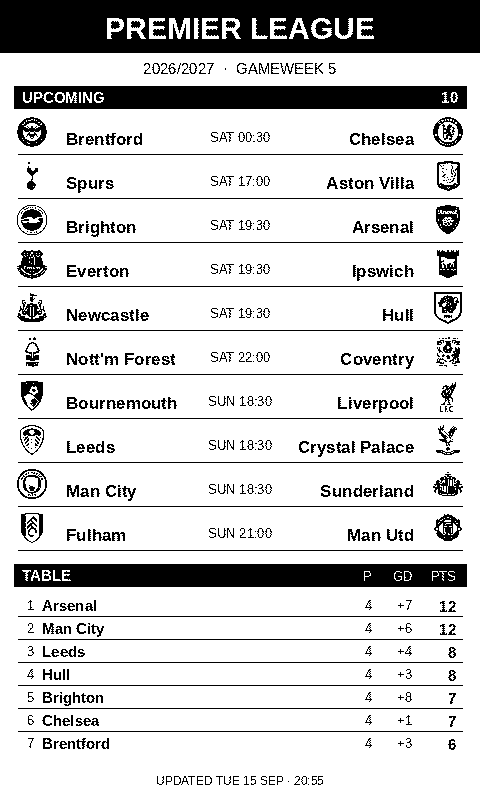

# Premier League wallpaper for the Xteink X4 Pro

A self-updating sleep screen: the current gameweek's results and kickoffs, plus
as much of the league table as fits, rendered as a 480×800 1-bit BMP.

A GitHub Action re-renders it every hour and commits the image when it changed,
so the raw URL below always serves the latest one.



## The image

```
https://raw.githubusercontent.com/<your-user>/<your-repo>/main/PremierLeague.bmp
```

480×800, 1-bit, ~47 KB — the size and format CrossPoint's custom sleep screen
wants on the X4 Pro. (The X3 is 528×792; change `WIDTH`/`HEIGHT` in the script
for other panels.)

## Putting it on the device

**Automatic** — with firmware that has the wallpaper updater: create
`/.crosspoint/wallpaper.txt` on the SD card containing the raw URL above, one
line. **Update Wallpaper** then appears in the library menu; it connects Wi-Fi,
downloads, and replaces `/sleep.bmp`.

**Manual** — on stock firmware: upload the BMP through **File Transfer**,
saving it as `sleep.bmp` at the SD card root.

Either way, set **Settings → Display → Sleep Screen → Custom** once.

## Running it yourself

```bash
pip install -r requirements.txt
python generate_wallpaper.py --preview          # writes .bmp and a .png to check
python generate_wallpaper.py --tz Europe/London # kickoff times in another zone
python generate_wallpaper.py --table-crests     # crests in the table too (fits fewer rows)
```

## How it works

Fixtures, results and standings come from the same no-key endpoint
premierleague.com's own site uses. Crests come from the Premier League CDN and
are cached in `crests/`.

Two things worth knowing if you adapt this:

- The badge CDN is keyed by **Opta id** (`t3` = Arsenal), which is unrelated to
  the team id the fixtures API returns (Arsenal is `1` there). Using the wrong
  one silently serves another club's crest, so the script resolves each club's
  badge id through `altIds`.
- Crests are hard-thresholded, never dithered — dithering reads as noise on
  e-ink. Each one is contrast-normalised first, or pale crests (Aston Villa's
  lion) collapse into an empty shield.

## Notes

- The repo must be **public** for the device to fetch the raw URL without
  credentials.
- GitHub disables scheduled workflows after ~60 days without repository
  activity. If the hourly run stops, open the Actions tab and re-enable it.
- `raw.githubusercontent.com` is CDN-cached for about five minutes, so a fresh
  commit takes a few minutes to reach the device.

Data from premierleague.com. Club crests are the property of their clubs; this
renders them for personal use on one device.
